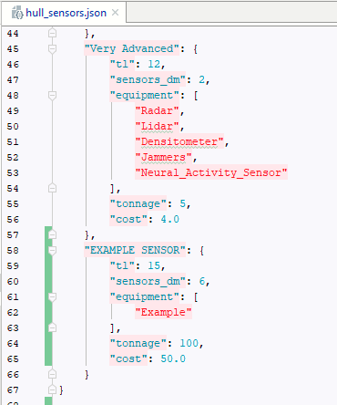
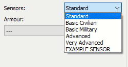
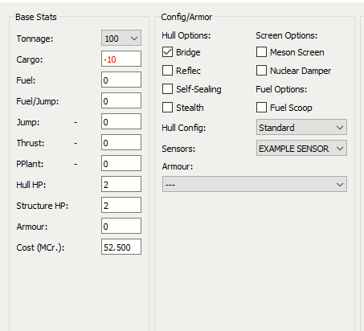
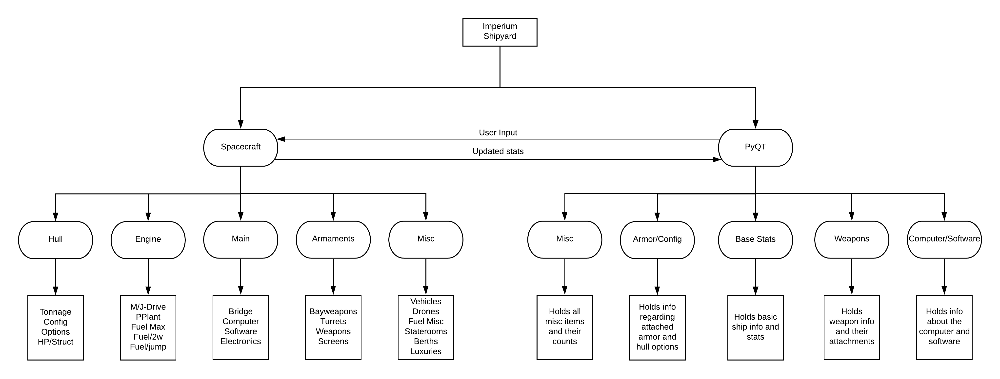

# imperium-shipyard
[](https://circleci.com/gh/Milkshak3s/imperium-shipyard)
[](https://coveralls.io/github/Milkshak3s/imperium-shipyard?branch=master)
Python ship designer for Mongoose Traveller SRD, 2nd Edition. Built using PyQT GUI and a JSON backend for data management
parsing. Utilizes a custom file format (.srd) in order to save, load, and share ships.

## Running:
There are two ways to run Imperium Shipyard, either through a cmd command by pulling the repo or by using the executable provided from our release page. The CMD option is more for development work and testing new features/tweaks.

For CMD (in root folder of imperium-shipyard): `python -m imperium.shipbuilder`

For EXE: simply double click the Imperium executable

## Folder Layout:
```
  ImperiumShipyard/
  │
  ├── ImperiumShipyard.exe
  |
  ├── imperium/
  │   ├── classes/   - Holds the Python classes that represent ship objects
  │   ├── resources/ - Holds the transcribed table values from the rulebook
  │   └── shipyard/  - Repository for holding .srd files
  ```

## Default Ships:
Included standard in Imperium Shipyard is a representation of every ship available in the Core Rulebooks, from the Laboratory Ship to the Corsair. The costs of these ships equally match the raw added totals in all cases. 

These ships can be loaded in via the file bar and are found within ImperiumShipyard/imperium/shipyard/models/default.
For creating custom ships by hand (outside of the program), the default.srd or model_template.json files can be used as references.

## Custom Parts:
Imperium Shipyard allows for easily adding customized parts to various parts for the ship. This is done by parsing the JSON 
backend on runtime, so simply adding a new item to their respective JSON files in the resources folder will add the part to use.

#### Available custom parts include:
<ul>
    <li>Hull Config</li>
    <li>Sensors</li>
    <li>Armour</li>
    <li>Computer Models</li>
    <li>Software/Software Levels</li>
    <li>Any Misc Items</li>
    <li>Sensors</li>
    <li>Turret Models/Weapons</li>
</ul>

#### Instructions for adding:
For example, to add a new Sensor tier, you simply add a new JSON item into the respective "hull_sensors.json" file according to the
attributes of the others.

Adding an item to the JSON:

</img>

After rereunning the program, if done correctly, you'll see the new part in its combobox:

</img>

And there you go, a custom part to use in your ships!

</img>


## TO-DO:
There are still a number of features wanting to be implemented that aren't explicitly needed for the base functionality
of the program, but would be great additions to have.

These include:
<ul>
    <li><b> Shipyard Refactor</b>: the current blobs that are the shipyard.py/spacecraft.py would be nice to refactor into
    different sections based off of relatedness, like an "armory" for turrets, weapons, etc.</li>
</ul>

Proposed Design Refactor:

</img>

## Credit
The ship design in our icon comes from Greer Mosher, available here: https://thenounproject.com/term/spaceship/269595/

This icon is available as a sample icon on Adobe Spark's Logo Maker under the CC License.
